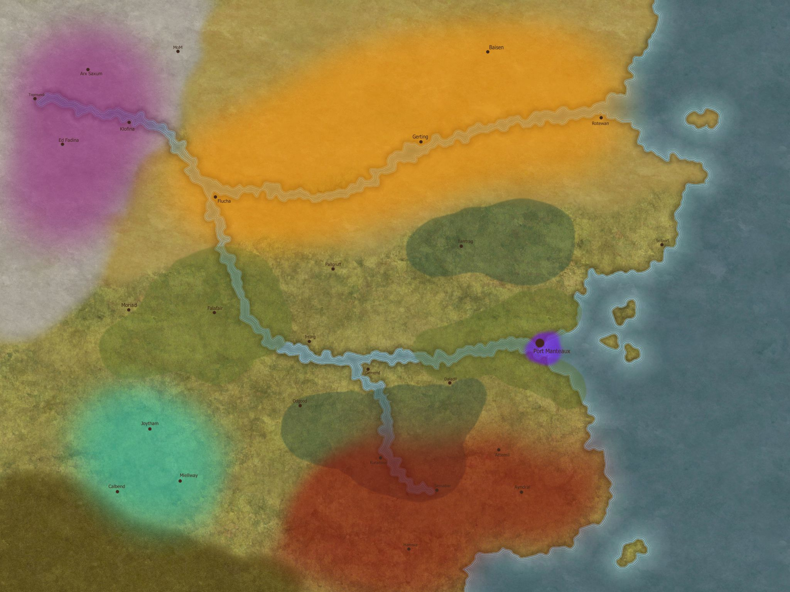

This wiki contains information about the homebrew setting of Burgundy. Below are some links to general content pages for navigation and exploration, or you can use the search bar on the top right if you know what you are looking for.

**The Mortal Races**
- [[Culture/Mortal Races/Dwarf|Dwarves]]
- [[Culture/Mortal Races/Elf|Elves]]
- [[Culture/Mortal Races/Goblin|Goblins]]
- [[Culture/Mortal Races/Halfling|Halflings]]
- [[Culture/Mortal Races/Human|Humans]]
- [[Culture/Mortal Races/Orc|Orcs]]

**The Kingdoms of the Continent**
- [[Geography/Agercort|Agercort]]
- [[Geography/Cruworia|Cruworia]]
- [[Geography/Mallerand|Mallerand]]
- [[Geography/Port Manteaux|Port Manteaux]]
- [[Geography/Vurnam|Vurnam]]
- [[Geography/Weald/Weald|the Weald]]

Other useful links:
- [[Mythos/The Mortal Gods|The Mortal Gods]]
- [[Bestiary Index|Bestiary of the Material Realm]]
- [[Mythos/List of Planar Realms|List of Planar Realms]]
- [[Culture/History/Timeline of the Material Realm|Timeline of the Material Realm]]